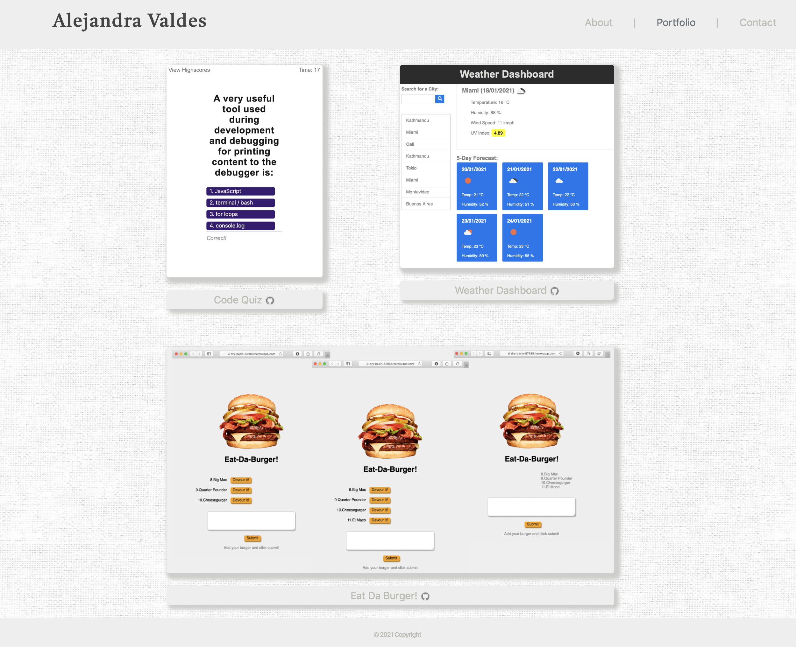
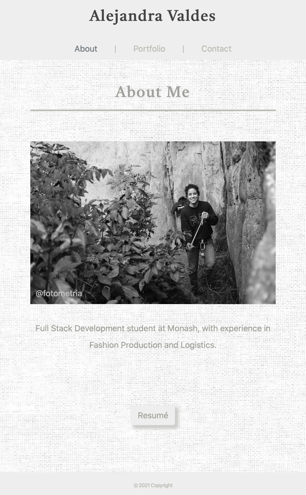
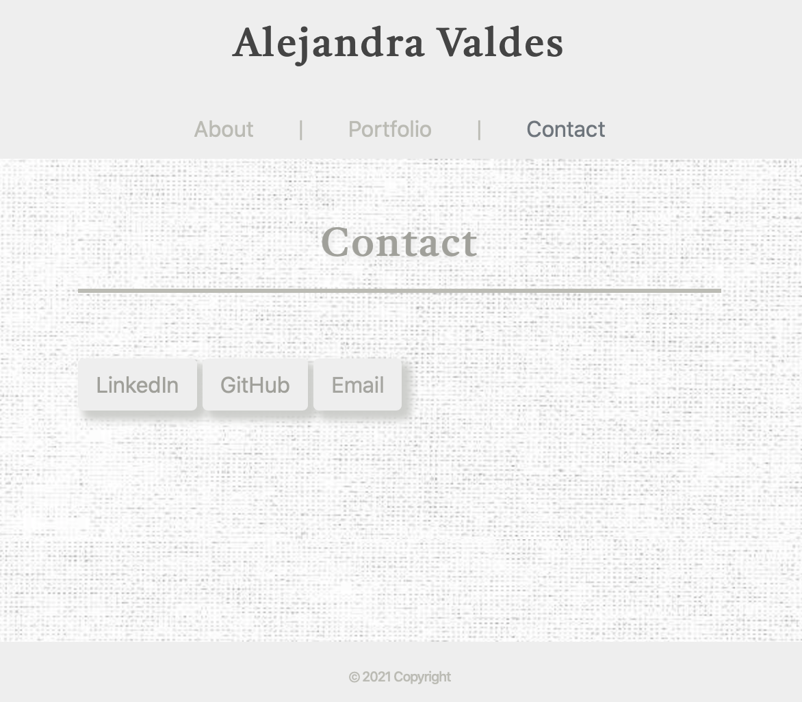

# Portfolio

Coding Bootcamp/02-CSS-Bootstrap/Homework

## Links:

Github pages link: 'https://avpizarro.github.io/Portfolio/'

Github repository link: 'https://github.com/avpizarro/Portfolio.git'

### The website consists of three pages: 

#### Portfolio.html

#### About me.html

#### Contact.html

